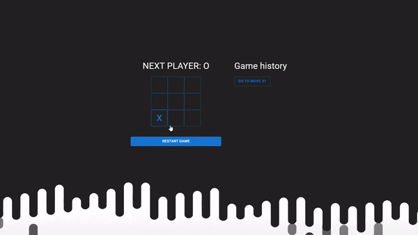

# Tic-tac-toe

The "tic-tac-toe" project in React is an implementation of the classic tic-tac-toe game. It allows players to play the game of tic-tac-toe. The project includes components for displaying the game board and game logic, as well as functions for checking for a winner and determining a draw.

<div align='center'></div>

### Key Learnings

While working on the "tic-tac-toe" project in React, I learned the following key concepts and techniques:

#### Creating Components

I learned how to create components in React, such as `Board`, `Square`, and `Button`, to organize the structure and display of the game board, squares, and buttons.

#### Managing State

I learned how to use the `useState` hook to manage the state of the game, such as the current turn, the state of the game board, and the winner.

#### Handling Events

I learned how to handle events, such as clicks on the squares of the game board, using the `handleClick` function to update the game state and make moves.

#### Checking for a Winner

I developed a `calculateWinner` function that allows me to determine the winner of the game and display the corresponding message.

```typescript
function calculateWinner(fieldsetValues: FieldValue[]): FieldValue | null {
  const lines = [
    [0, 1, 2],
    [3, 4, 5],
    [6, 7, 8],
    [0, 3, 6],
    [1, 4, 7],
    [2, 5, 8],
    [0, 4, 8],
    [2, 4, 6],
  ]
  for (let i = 0; i < lines.length; i++) {
    const [a, b, c] = lines[i]
    if (
      fieldsetValues[a] &&
      fieldsetValues[a] === fieldsetValues[b] &&
      fieldsetValues[a] === fieldsetValues[c]
    ) {
      return fieldsetValues[a]
    }
  }
  return null
}
```

#### Conditional Rendering

I applied conditional rendering to display different game states, such as the current player, the winner, or a draw.

#### Using Third-Party Libraries

I used the `@mui/material` library to style UI elements, such as buttons.

#### Deploying the Project

I deployed the project on the GitHub Pages platform and provided a demonstration of the project through the [link](dmitrylasuta.github.io/tic-tac-toe/.)

Conclusion
Working on the "tic-tac-toe" project in React provided me with valuable experience and allowed me to master the basics of creating components, managing state, handling events, and deploying a project.
